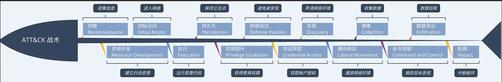

# MITRE ATT&CK框架
ATT&CK框架主要包括以下内容：

1. 战术（Tactics）：ATT&CK框架定义了11个战术，描述了对抗性行为者在攻击过程中的高级目标。这些战术包括初始访问（Initial Access）、执行（Execution）、持久性（Persistence）、特权升级（Privilege Escalation）、凭证访问（Credential Access）、发现（Discovery）、移动（Lateral Movement）、收集（Collection）、扩散（Exfiltration）、命令与控制（Command and Control）和影响（Impact）。

2. 技术（Techniques）：ATT&CK框架定义了数百种具体的攻击技术和方法，每种技术都与一个或多个战术相关联。这些技术描述了对抗性行为者在攻击过程中使用的具体手段，例如恶意软件的使用、漏洞利用、社会工程等。

3. 知识库（Common Knowledge）：ATT&CK框架还提供了一些常见知识，用于描述和组织对抗性行为者的行为模式和技术。这些知识包括攻击者的工具、行为模式、攻击路径等。

4. 矩阵（Matrix）：ATT&CK框架通过矩阵的形式展示了不同战术和技术之间的关系。矩阵将战术和技术按照层级结构进行组织，使用户可以更好地了解攻击者的行为模式和攻击路径。

5. 攻击模拟（Adversary Emulation）：ATT&CK框架还提供了一些攻击模拟工具和方法，帮助用户模拟对抗性行为者的攻击行为，以测试和评估网络和计算环境的安全性。

通过以上内容，ATT&CK框架提供了一个详细的分类系统和知识库，帮助安全团队更好地了解和应对对抗性行为者的威胁行为。
>网址:https://attack.mitre.org/tactics/

## 战术
## 技术
## 知识库
## 矩阵
## 攻击模拟