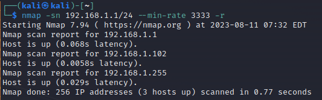
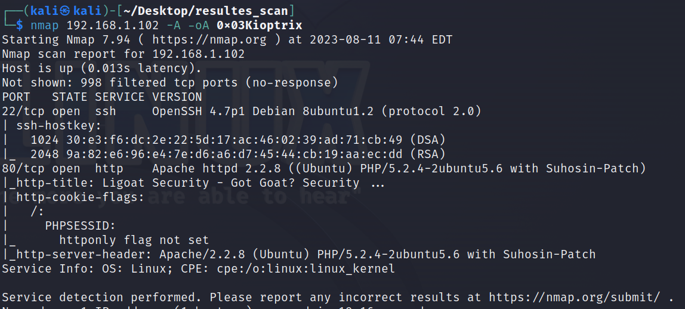
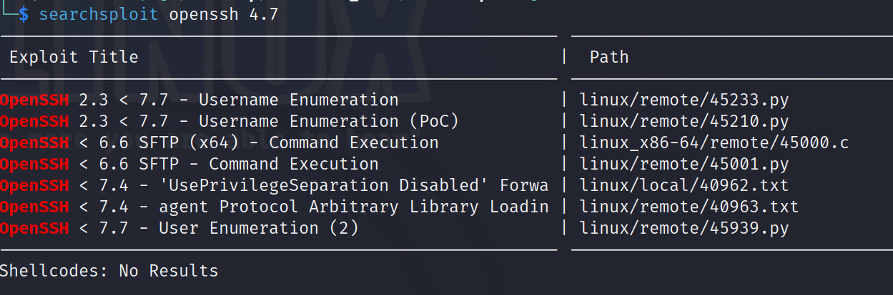
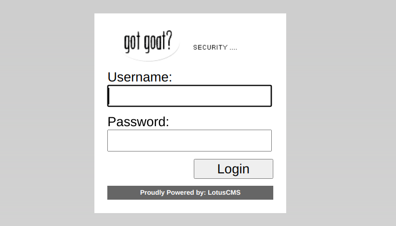
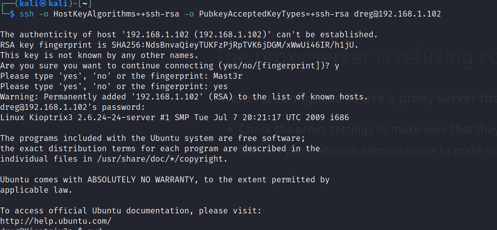

# 0x03KioptrixSQL+sudo提权
## 主机发现
```
nmap -sn 192.168.1.1/24 --min-rate 3333 -r
```

扫描到102主机
## 主机指纹识别
```
nmap 192.168.1.102 -A -oA 0x03Kioptrix
```
这个错误提示表明SSH客户端无法与远程主机建立安全连接，因为它们之间没有匹配的主机密钥类型。

这个问题通常是由于SSH客户端和远程主机之间的密钥算法不匹配引起的。在较新的SSH客户端版本中，默认情况下可能不再支持使用RSA或DSA密钥算法进行连接，而远程主机可能仍在使用这些算法。

要解决这个问题，你可以尝试以下方法：

指定支持的密钥算法：在SSH命令中使用-o选项，指定客户端支持的密钥算法。例如，可以尝试使用以下命令连接到远程主机
```
ssh -o HostKeyAlgorithms=+ssh-rsa -o PubkeyAcceptedKeyTypes=+ssh-rsa username@remote_host
```
## 漏洞利用

发现22，80端口开放
22端口为openssh4.7
使用msf寻找该版本漏洞

不易利用
查看80端口
发现登录窗口

尝试SQL注入
爆破出主机密码，ssh远程连接登录
loneferret 5badcaf789d3d1d09794d8f021f40f0e  starwars
dreg 0d3eccfb887aabd50f243b3f155c0f85  Mast3r
admin n0t7t1k4（后台账户密码，没找到后台）
## 远程登录

登录成功

## 尝试提权
计划任务
```
cat /etc/crontab
```
无root权限的可利用计划任务
suid程序
```
find -perm -u=s type -f
```
发现ht编辑器
用ht编辑器打开/etc/passwd
将用户权限更改为root
或取消/etc/sudoers文件的用户sudo权限范围限制
提权成功