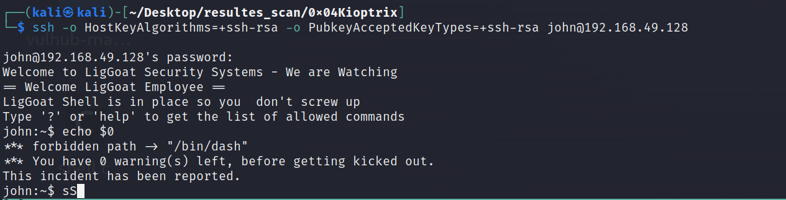

# 0x04Kioptrix shell越狱+mysql udf提权
## 大致思路：
发现主机和端口服务
登录80端口
使用爆破数据库
发现账户，同时也是主机账户
```
cat /home/kali/.local/share/sqlmap/output/192.168.49.128/dump/members/members.csv                  
id,username,password
1,john,MyNameIsJohn
2,robert,ADGAdsafdfwt4gadfga==

```
使用ssh登录
被限制在kshell中

使用kshell绕过

切换到bash
提权：
suid,计划任务，sudoers文件，path环境变量，myql udf提权
成功
